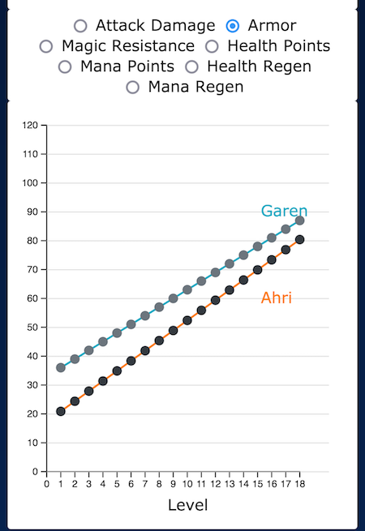

# League of Legends Champions Statistics

## Description
This web app helps visualise and compare [LoL](https://euw.leagueoflegends.com/en-gb/) champions' base statistics using Mike Bostock's JavaScript library [D3](https://d3js.org/).

This project was developped in the context of Isaac Pante's course "Visualisation de données" in Spring 2021 at the Université de Lausanne. The project can be viewed here: [Link](https://astonedf.github.io/D3LoLChampStats/)

## Database

The game League of Legends has over 150 playable champions with different base stats, abilities, strengths and weaknesses. Even though it might be easy to find information on each champion either in the game itself or any website for example the game's [Fandom](https://leagueoflegends.fandom.com/wiki/List_of_champions/Base_statistics) wiki, none of them offer a way to quickly compare and visualise base stats.

I found a downloadable csv version on [kaggle](https://www.kaggle.com/gyejr95/league-of-legendslol-champion-and-item-2020?select=riot_champion.csv) of the patch 10.6.1 which I use to create the graphs.

Since the champion stats are constantly changing (in order to balance the game), in the future I'd like to link the app to the [Official League of Legends API](https://developer.riotgames.com/docs/lol#_getting-started) so that the data would be up to date.

## Data

Every champion in League of Legends has base stats that change as they level up (with some exceptions):

- `Attack Damage`
- `Health`
- `Mana` (some champions do not use mana)
- `Armor`
- `Magic Resistance` (often shortened to MR or here Magic Resist)
- `Health Regeneration` (HP Regen)
- `Mana Regeneration` (MP Regen)

Explained in detail here: [Fandom](https://leagueoflegends.fandom.com/wiki/Champion_statistic)

There are many other base stats as well (`Movement Speed` for example) but they do not increase with levels and therefore I decided not to compare them. 
The raw data (csv) only gives the base stat: `100 health points` for example and the stat per level `10 health points per level` so the value for each level was calculated with a function (`statPerLevel()`) giving the stat value for each level.

## Interface

**Champion selection** : You can choose two champions you want compare by searching them by name and selecting their levels.

**Percentage barplot** : You can quickly see which champion has higher base stat values. Simply calculated like this: `champion 1 stat % = champion 1 stat / (champion 1 stat + champion 2 stat)` and vice versa.

**Line graph** : Shows the selected base stat value at every level. Sometimes a champion might have a higher `base stat` at level 1 than another champion but a lower `stat per level` and the line graph helps to see if a champion will catch up or even end up having a higher `base stat` at some point. You can hover over the dots to get the level and the value.

**Mobile** : The app works on most mobile screens (not optimised for screens that are less than 375px wide)

## Copyrights

All images belong to Riot Games Inc but can be used as intellectual property.\
More details on the [Fandom](https://leagueoflegends.fandom.com/wiki/Category:Images_copyrighted_to_Riot_Games) page.

Favicon from [favicon-generator](https://www.favicon-generator.org/search/DARK_BLUE/Squares)

## Author

_Saara Jones_